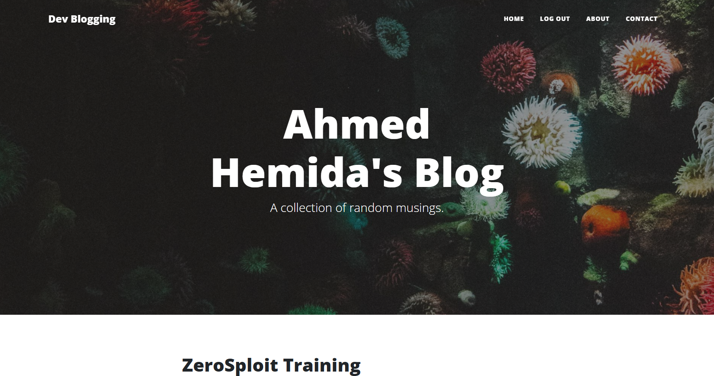
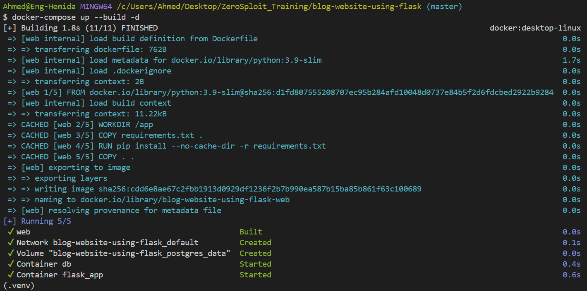
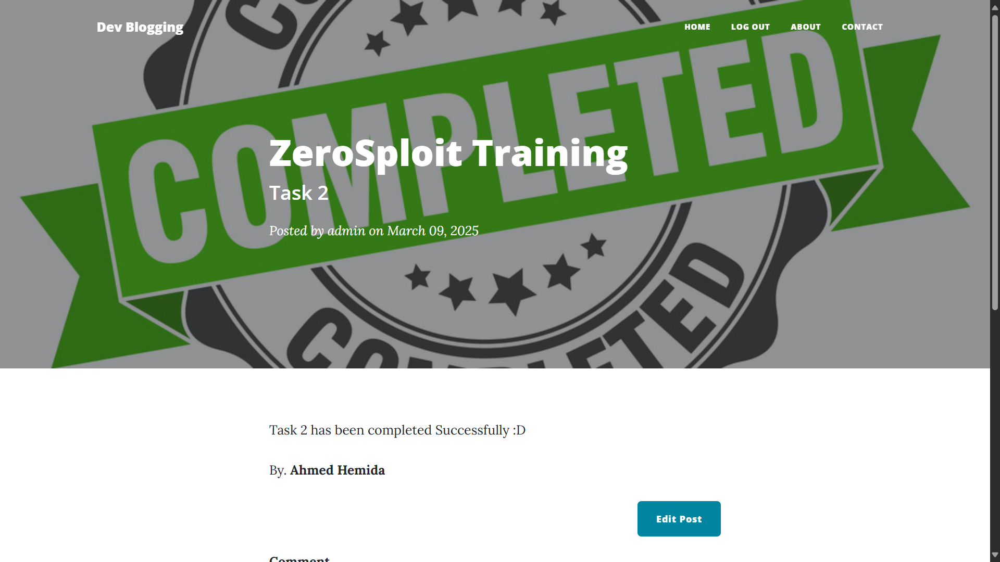
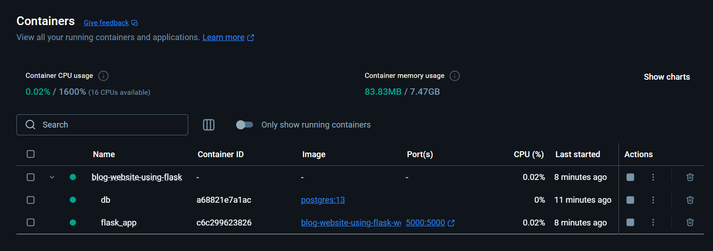

# Blog with Users

Welcome to Blog with Users, a Flask-based blog application that allows users to register, log in, create posts, and comment on posts. This project is designed to showcase user authentication, authorization, and database integration using `PostgreSQL` and `SQLAlchemy`. It also includes an admin-only section for managing blog posts.



## Features

- User Authentication: Register and log in securely with password hashing.

- Admin Privileges: Only admins can create, edit, or delete blog posts.

- Comment System: Users can comment on blog posts.

- Gravatar Integration: Automatically display user profile images using Gravatar.

- Responsive Design: Built with Bootstrap 5 for a sleek and modern look.

- CSRF Protection: Secure forms with Flask-WTF.

- Docker Support: Easily deploy the app using Docker Compose.

## Installation


### Prerequisites

- Python 3.9 or higher
- Docker (for containerized deployment)
- PostgreSQL (if not using Docker)

### Clone the Repository

```sh
git clone https://github.com/yourusername/blog-with-users.git
cd blog-with-users
```
### Set Environment Variables
Create a `.env` file in the project root and add the following environment variables:
```sh
APP_SECRET_KEY=your_generated_secret_key_here
POSTGRES_USER=postgres
POSTGRES_PASSWORD=postgres
POSTGRES_HOST=db
POSTGRES_PORT=5432
POSTGRES_DB=blog_db
```

### Run with Docker Compose

1. Build and Start the Containers:
```bash
docker-compose up --build
```
You will see an output like this:


2. Access the Application:

Open your browser and navigate to `http://localhost:5000`.


3. To check the docker containers


3. To stop the Containers you can run:
```bash
docker-compose down
```

### Docker Compose File Explanation
```bash
version: '3.8'
```
- `version: '3.8'`: Specifies the version of the Docker Compose file format. Version 3.8 is compatible with Docker Engine 19.03.0 and above.

1. Web Service (Flask App)
```yaml
web:
  build: .
  container_name: flask_app
  ports:
    - "5000:5000"
  volumes:
    - .:/app
  environment:
    - FLASK_APP=main.py
  env_file:
    - database.conf
  depends_on:
    - db
```

- build: .: Tells Docker to build the image using the Dockerfile located in the current directory (.).

- container_name: flask_app: Assigns a name (flask_app) to the container for easier reference.

- ports: - "5000:5000": Maps port 5000 on the host machine to port 5000 in the container. This allows you to access the Flask app at http://localhost:5000.

- volumes: - .:/app: Mounts the current directory (.) on the host to the /app directory in the container. This ensures that changes to the code on your local machine are reflected in the container.

- environment: - FLASK_APP=main.py: Sets the FLASK_APP environment variable to main.py, which tells Flask which file to run.

- env_file: - database.conf: Loads environment variables from the database.conf file. This file contains the database connection details.

- depends_on: - db: Ensures that the db service starts before the web service. This is important because the Flask app depends on the PostgreSQL database.

2. Database Service (PostgreSQL)
```yaml
db:
  image: postgres:13
  container_name: db
  env_file:
    - database.conf
  volumes:
    - postgres_data:/var/lib/postgresql/data
```
- image: postgres:13: Uses the official PostgreSQL 13 image from Docker Hub.

- container_name: db: Assigns a name (db) to the container for easier reference.

- env_file: - database.conf: Loads environment variables from the database.conf file. This file contains the database credentials (username, password, etc.).

- volumes: - postgres_data:/var/lib/postgresql/data: Persists the PostgreSQL data in a Docker volume named postgres_data. This ensures that the database data is not lost when the container is stopped or removed.

3. Volumes
```yaml
volumes:
  postgres_data:
```
- postgres_data: Defines a named volume for storing PostgreSQL data. This volume is mounted to /var/lib/postgresql/data in the db container.


## Docker Deployment

### Build the Docker Image
```sh
docker build -t blog-with-users .
```

### Run the Docker Container
```sh
docker run -d -p 5000:5000 --name blog-with-users blog-with-users
```

The application will be available at `http://127.0.0.1:5000`.

## Manual Installation (Without Docker)

### Create a Virtual Environment
```sh
python -m venv .venv
source .venv/bin/activate  # On Windows use `.venv\Scripts\activate`
```

### Install Dependencies
```sh
pip install -r requirements.txt
```


### Run the Application
```sh
flask run
```

The application will be available at `http://127.0.0.1:5000`.

## Project Structure
```plaintext
blog-with-users/
├── .venv/                  # Virtual environment
├── templates/
│   ├── about.html
│   ├── contact.html
│   ├── footer.html
│   ├── header.html
│   ├── index.html
│   ├── login.html
│   ├── make-post.html
│   ├── post.html
│   ├── register.html
│   └── ...
├── static/
│   ├── assets/
│   │   ├── img/
│   │   │   ├── login-bg.jpg
│   │   │   └── ...
│   │   └── ...
│   └── ...
├── forms.py                # Flask-WTF forms
├── main.py                 # Main application file
├── requirements.txt        # Python dependencies
├── Dockerfile              # Dockerfile for containerization
├── docker-compose.yml      # Docker Compose configuration
├── database.conf           # Database configuration
├── config.py               # Configuration helper
```

## Technologies Used

- Flask: A lightweight Python web framework.

- SQLAlchemy: ORM for database interactions.

- PostgreSQL: A powerful, open-source relational database.

- Bootstrap 5: Front-end framework for responsive design.

- Flask-Login: User session management.

- Flask-WTF: Form handling and CSRF protection.

- Docker: Containerization for easy deployment.

## Usage

### Register
Navigate to `/register` to create a new user account.

### Login
Navigate to `/login` to log in with an existing account.

### Create a Post
Navigate to `/new-post` (admin only) to create a new blog post.

### Edit a Post
Navigate to `/edit-post/<post_id>` (admin only) to edit an existing blog post.

### Delete a Post
Navigate to `/delete/<post_id>` (admin only) to delete a blog post.

### Comment on a Post
Navigate to `/post/<post_id>` to view and comment on a blog post.